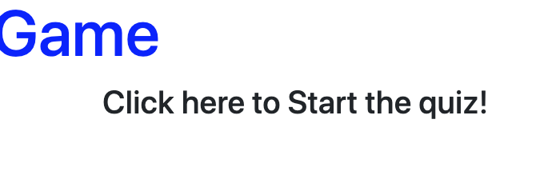
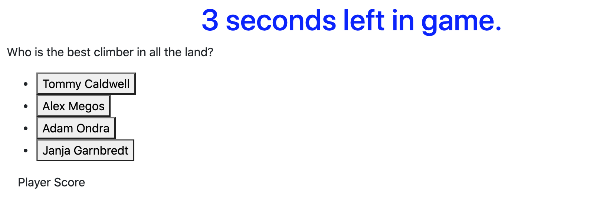
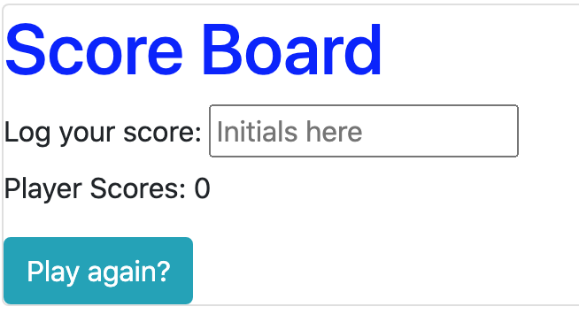
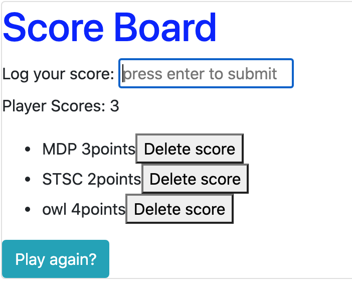

# javaScript vocabQuiz
Utelizing JavaScript and web API's to create an interactive game and store information in local storage.

## Overview

This application leads the user through a timed multiple choice quiz. At the end of the quiz the user can save their score with their own name or initials. They may then restart the game to try the quiz again to save another score. A user can easily delete any score they choose off of the score board. 

## License

[link](https://gist.github.com/lukas-h/2a5d00690736b4c3a7ba#the-mit-license)
## Functionality
When the page is initiall loaded there is a title and a message on the screen that reads, "click here to start the quiz."

When this section of the page is clicked this image disappears and the quiz begins. A timer appears above and a question is presented. There are four options for each question. The user chooses an option by clicking on the button with the desired answer. If the answer is correct the user is granted a point, otherwise time is taken from the clock. After any button is clicked, the user is presented with the next question.

Finally the game ends when either all questions are answered or time expires. This is where the user is given the choice to save their scores in the local storage. The user may also play the game again by pushing the restart button.

After the user submits a few scored the score board becomes polulated with each player's name and score attatched.

## Technology

Bootstrap was used to create the basic outline of the page and all of the necessary buttons. JavaScript and Web API's were used to create the functionality of the game and store user information in the local storage.

## Deployment

The game is fully functional but is still in development. The javaScript runs with no errors and accomplishes all the goals for this quiz. Changes need to be made for the questions to be relevent to coding and have more than only 4 questions. The display is also very bare and will need to be polished up. 

# URL
https://mikeyp957.github.io/javaScript_vocabQuiz/ 
